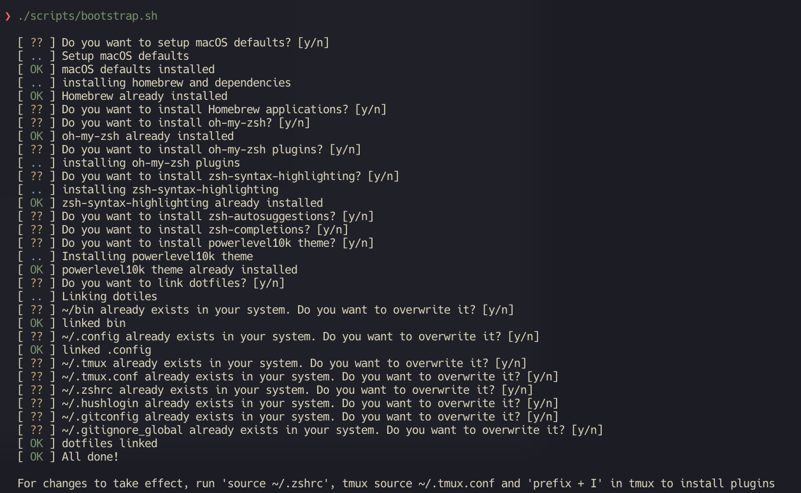

# Ma :construction: k's Dotfiles

`macOS` | `homebrew` | `alacritty` | `zsh` | `tmux` | `nvim` | `git` | `fonts`



## Symlinks

Setting up your environment this way is really amazing. You simply tweak the
configurations here, and voila, they seamlessly apply to your entire system via
symlinks.

- `./.config`: -> `~/.config` - Contains **Alacrity**, **nvim** configs
- `./bin`: -> `~/.bin` - Anything in bin/ will get added to your $PATH and be made available everywhere.
- `.tmux`: -> `~/.tmux` - Tmux plugins
- `.tmux.conf`: -> `~/.tmux.conf` - Tmux config
- `.zshrc`: -> `~/.zshrc` - Zsh config
- `.hushlogin`: -> `~/.hushlogin` - Hide login message in terminal
- `.gitconfig`: -> `~/.gitconfig` - Git config
- `.gitignore_global`: -> `~/.gitignore_global` - Git ignore

## Install

```terminal
# Clone the repo with submodules
git clone --recurse-submodules git@github.com:MarkSeliverstov/.dotfiles.git
cd .dotfiles
chmod +x ./scripts/bootstrap.sh
./scripts/bootstrap.sh
```

### What it will do

- Ask you if you want to install each part of the setup
- Set up macOS defaults
- Install **Homebrew** and **Homebrew Casks** (tmux, fzf, zsh, nvim, alacrity ...)
  - Script will ask you if you want to install apps from `./homebrew/Brewfile`
- Set up **zsh**, **oh-my-zsh** and **powerlevel10k**
- Set up **nvim**
- Set up **tmux** and **tmux plugins** (you will need to run `tmux source ~/.tmux.conf` and `prefix + I` to install plugins)
- Set up **Alacritty**
- Downloand and setup **fonts** (JetBrainsMono, NerdFonts)
- Also in `./rectangle` you can find config for **Rectangle** app
