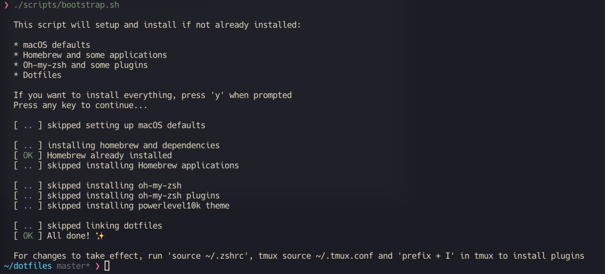

# Ma :construction: k's Dotfiles

`macOS` | `homebrew` | `alacritty` | `zsh` | `tmux` | `nvim` | `git` | `fonts`



# About

This is my personal dotfiles setup. It's a collection of configurations and
scripts that I use to set up my development environment. It's a work in
progress, and I'm constantly tweaking things here and there. Feel free to use
it as a reference or fork it and make it your own at your own risk :smile:

## ./scripts/bootstrap.sh

### Why?

Everytime I set up a new Mac, I spend a lot of time (up to 1 day) configuring
it. I decided to automate this process and make it easier for me to set up my
development environment. And it definitely worked! Now I can set up my Mac in
less than 10 minutes.

### What?

This script will install all the necessary tools and applications for you. It
will also set up your macOS defaults, **homebrew**, **Brewfile**,  **zsh**, **oh-my-zsh**,
**powerlevel10k**, **nvim**, **tmux**, **Alacritty**, **fonts** and **git**.

## Tricks

### Symlinks

Setting up your environment this way is really amazing. You simply tweak the
configurations here, and voila, they seamlessly apply to your entire system via
symlinks.

- `./.config`: -> `~/.config` - Contains **Alacrity**, **nvim** configs
- `./bin`: -> `~/.bin` - Anything in bin/ will get added to your $PATH and be made available everywhere.
- `.tmux`: -> `~/.tmux` - Tmux plugins
- `.tmux.conf`: -> `~/.tmux.conf` - Tmux config
- `.zshrc`: -> `~/.zshrc` - Zsh config
- `.hushlogin`: -> `~/.hushlogin` - Hide login message in terminal
- `.gitconfig`: -> `~/.gitconfig` - Git config
- `.gitignore_global`: -> `~/.gitignore_global` - Git ignore

# Install

```terminal
# Clone the repo with submodules
git clone --recurse-submodules git@github.com:MarkSeliverstov/.dotfiles.git
cd .dotfiles
chmod +x ./scripts/bootstrap.sh
./scripts/bootstrap.sh
```

